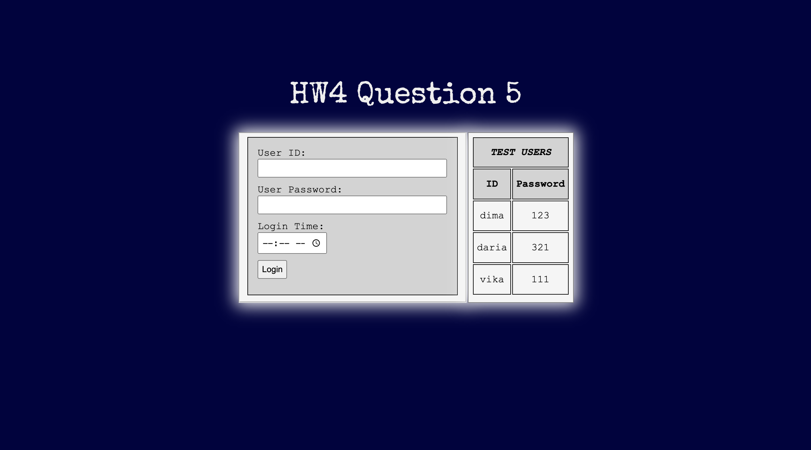
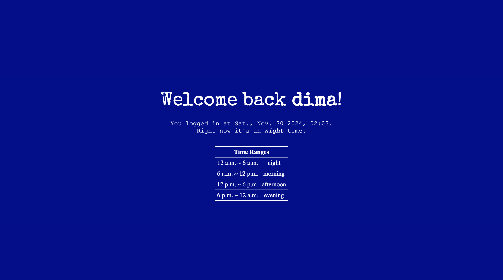

# Login Screen Project for HW4 Question 5

Welcome to the Login Screen Project for HW4 Question 5! This repository contains an interactive login screen implementation that meets the requirements specified in the task. It demonstrates HTML, CSS, and JavaScript integration to handle user input, authentication, and dynamic page theming.

---

## Features

### 1. Login Screen
- **Fields**:
  - User ID (text input)
  - Password (password input)
  - Login Time (optional time input using `<input type="time">`)
  - Login button.
- **Predefined Users**:
  Three user IDs and passwords are predefined for testing:
  - `dima`: `123`
  - `daria`: `321`
  - `vika`: `111`
- **Validation**:
  - **Mandatory Fields**: Both User ID and Password are required. Alerts are displayed if they are empty.
  - **Optional Field**: If no time is selected, the current time is automatically used.

### 2. Authentication
- Compares the provided User ID and Password against the predefined list.
- Alerts if the ID or Password is incorrect.
- Successful login redirects to the next page and saves:
  - User ID
  - Login time (as a JavaScript `Date` object)

### 3. Welcome Page
- Displays a personalized welcome message with:
  - User ID
  - Formatted login time (e.g., `Mon., Jan. 1 2024, 10:00 AM`)
- Dynamically adjusts the page theme (background and text colors) based on the time of day:
  - **Morning**: `6:00 AM ~ 12:00 PM`
  - **Afternoon**: `12:00 PM ~ 6:00 PM`
  - **Evening**: `6:00 PM ~ 12:00 AM`
  - **Night**: `12:00 AM ~ 6:00 AM`

---

## File Structure
```
├── q5.html                # Main Login Page
├── q5-2.html              # Welcome Page
├── q5-style.css           # CSS Styles for the project
├── README.md              # Documentation
```

---

## How to Run

### Clone the Repository:
```bash
git clone https://github.com/yudm3/web-prog-hw4-q5.git
cd web-prog-hw4-q5
```

### Open `q5.html`:
- Use any modern browser to open `q5.html`.
- Example:
  ```bash
  open q5.html
  ```

### Test with Predefined Users:
- User ID: `dima`, Password: `123`
- User ID: `daria`, Password: `321`
- User ID: `vika`, Password: `111`

### Explore the Dynamic Theme:
- Use different login times to observe changes in the welcome page's theme.

---

## Code Highlights

### Authentication Logic
**Predefined user list:**
```javascript
var userList = [
    ["dima", 123],
    ["daria", 321],
    ["vika", 111]
];
```

**Validation and Login:**
```javascript
function createUser() {
    if (current_user.userID == "" || current_user.userPASS == "") {
        alert("Please enter your ID and Password!");
        return;
    }
    ...
    if (isFound) {
        alert("Login is successful!");
        window.localStorage.setItem("userID", current_user.userID);
        window.localStorage.setItem("userDATE", current_user.userDATE);
        window.open("./q5-2.html", "_self");
    } else {
        alert("Either ID or Password is incorrect!");
    }
}
```

### Dynamic Page Theme
**Determine the time of day and apply styles:**
```javascript
var userHour = userDATE.getHours();
if (userHour >= 18) {
    bodyElement.classList.add("evening-animation");
} else if (userHour >= 12) {
    bodyElement.classList.add("afternoon-animation");
} else if (userHour >= 6) {
    bodyElement.classList.add("morning-animation");
} else {
    bodyElement.classList.add("night-animation");
}
```

---

## Screenshots

### Login Page


### Welcome Page (Night Theme)


---

## Technologies Used
- **HTML5**: Structure of the web pages.
- **CSS3**: Styling and animations.
- **JavaScript**: Logic for authentication, theming, and data handling.
- **Local Storage**: Data persistence across pages.

---

## Future Improvements
1. Add password encryption for secure authentication.
2. Expand the predefined user list dynamically.
3. Improve responsiveness for better mobile compatibility.
4. Add logout functionality to clear local storage.

---

Enjoy exploring the Login Screen Project! 🚀
